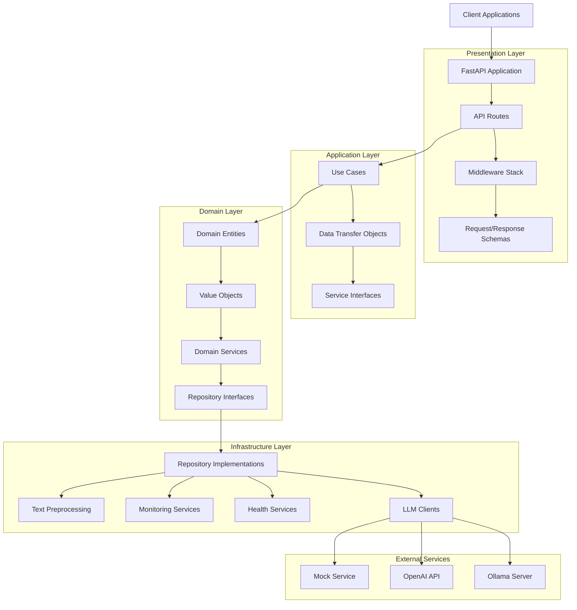
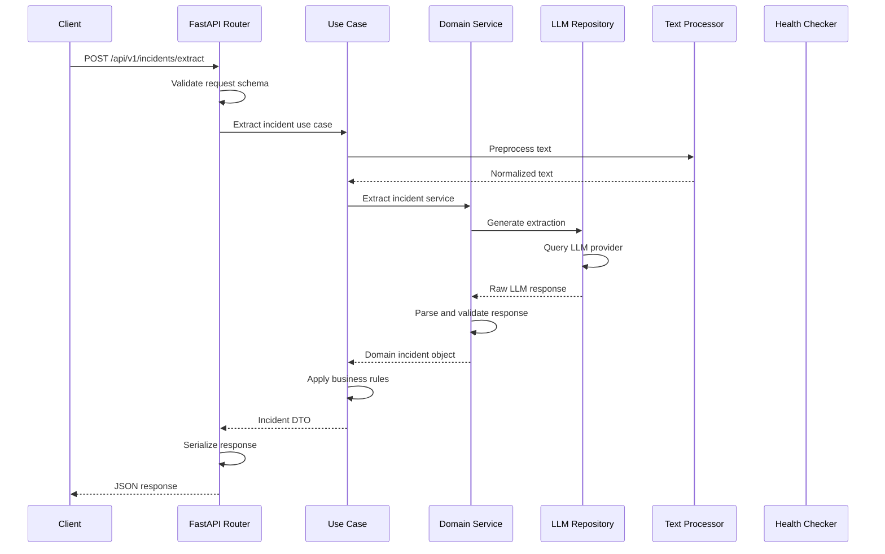
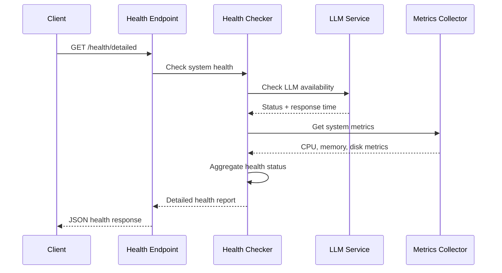

# Architecture Documentation

## Table of Contents

- [Overview](#overview)
- [Architectural Patterns](#architectural-patterns)
- [System Architecture](#system-architecture)
- [Layer Responsibilities](#layer-responsibilities)
- [Component Details](#component-details)
- [Data Flow](#data-flow)
- [Technology Stack](#technology-stack)
- [Design Decisions](#design-decisions)
- [Quality Attributes](#quality-attributes)
- [Future Considerations](#future-considerations)

## Overview

The Incident Extractor API is built using **Clean Architecture** principles combined with **Domain-Driven Design (DDD)** to create a maintainable, testable, and scalable system. The architecture emphasizes separation of concerns, dependency inversion, and business logic isolation.

### Core Principles

1. **Dependency Rule**: Dependencies point inward toward the domain
2. **Business Logic Isolation**: Core logic independent of external concerns
3. **Testability**: Each layer can be tested in isolation
4. **Flexibility**: Easy to change external dependencies
5. **Maintainability**: Clear separation of responsibilities

## Architectural Patterns

### Clean Architecture

The system is organized in concentric layers, with the domain at the center:

```
┌─────────────────────────────────────────┐
│           Presentation Layer            │ ← Frameworks & Drivers
├─────────────────────────────────────────┤
│          Infrastructure Layer           │ ← Interface Adapters
├─────────────────────────────────────────┤
│           Application Layer             │ ← Use Cases
├─────────────────────────────────────────┤
│             Domain Layer                │ ← Entities & Business Rules
└─────────────────────────────────────────┘
```

### Domain-Driven Design

- **Ubiquitous Language**: Consistent terminology across all layers
- **Domain Models**: Rich entities with business behavior
- **Value Objects**: Immutable objects representing domain concepts
- **Domain Services**: Complex business logic coordination
- **Repository Pattern**: Abstract data access layer

### Dependency Injection

Uses `dependency-injector` for IoC container management:
- **Singleton Providers**: Expensive resources (clients, loggers)
- **Factory Providers**: Dynamic object creation
- **Configuration Providers**: Environment-based configuration

## System Architecture

### High-Level Architecture



### Project Structure

```
src/incident_extractor/
├── 🎯 domain/                    # Business Logic Core
│   ├── entities/
│   │   ├── __init__.py
│   │   └── incident.py          # Core business entity
│   ├── value_objects/
│   │   ├── __init__.py
│   │   ├── incident.py          # Incident-related values
│   │   ├── location.py          # Location value object
│   │   └── common.py           # Shared value objects
│   ├── repositories/
│   │   ├── __init__.py
│   │   ├── incident_repository.py    # Incident data contract
│   │   └── llm_repository.py         # LLM service contract
│   ├── services/
│   │   ├── __init__.py
│   │   ├── incident_extraction_service.py
│   │   ├── incident_validation_service.py
│   │   └── incident_enrichment_service.py
│   ├── specifications/
│   │   ├── __init__.py
│   │   ├── base.py
│   │   └── incident_specifications.py
│   ├── events/
│   │   ├── __init__.py
│   │   ├── base.py
│   │   └── incident_events.py
│   ├── exceptions/
│   │   └── __init__.py
│   └── enums.py                # Domain enumerations
│
├── 🔄 application/              # Use Cases & Application Services  
│   ├── dtos/
│   │   ├── __init__.py
│   │   └── incident_dtos.py    # Data transfer objects
│   ├── use_cases/
│   │   ├── __init__.py
│   │   └── extract_incident_use_case.py
│   └── interfaces/
│       ├── __init__.py
│       └── incident_service_interface.py
│
├── 🔌 infrastructure/           # External Concerns
│   ├── llm/
│   │   ├── clients/
│   │   │   ├── __init__.py
│   │   │   ├── base_client.py       # Abstract LLM client
│   │   │   ├── ollama_client.py     # Ollama implementation
│   │   │   ├── openai_client.py     # OpenAI implementation  
│   │   │   └── mock_client.py       # Testing implementation
│   │   ├── repository/
│   │   │   ├── __init__.py
│   │   │   └── llm_repository_impl.py  # Repository implementation
│   │   ├── resilience/
│   │   │   ├── __init__.py
│   │   │   ├── circuit_breaker.py
│   │   │   └── retry.py
│   │   └── factory.py              # LLM client factory
│   ├── health/
│   │   ├── __init__.py
│   │   └── health_checker.py      # Health check service
│   ├── monitoring/
│   │   ├── __init__.py
│   │   └── metrics_collector.py   # Metrics collection
│   ├── logging/
│   │   ├── __init__.py
│   │   └── structured_logger.py   # Structured logging
│   └── preprocessing/
│       ├── __init__.py
│       └── text_processor.py      # Brazilian Portuguese processing
│
├── 🌐 presentation/             # API Layer
│   ├── api/
│   │   └── v1/
│   │       └── endpoints/
│   │           ├── __init__.py
│   │           ├── incidents.py   # Incident extraction endpoints
│   │           ├── health.py      # Health check endpoints
│   │           ├── admin.py       # Admin endpoints
│   │           └── auth.py        # Authentication endpoints
│   ├── middleware/
│   │   ├── __init__.py
│   │   ├── error_handler.py      # Global error handling
│   │   ├── logging.py            # Request/response logging
│   │   ├── metrics.py            # Metrics collection
│   │   ├── request_id.py         # Request ID generation
│   │   ├── rate_limiting.py      # Rate limiting
│   │   └── auth.py              # Authentication middleware
│   ├── schemas/
│   │   ├── __init__.py
│   │   ├── requests.py          # Request schemas
│   │   ├── responses.py         # Response schemas
│   │   └── common.py           # Common schemas
│   └── app.py                   # FastAPI application factory
│
└── ⚙️ core/                    # Cross-cutting Concerns
    ├── config/
    │   ├── __init__.py
    │   ├── config.py           # Main configuration
    │   ├── llm_settings.py     # LLM-specific settings
    │   └── logging.py          # Logging configuration
    ├── exceptions/
    │   ├── __init__.py
    │   ├── base.py            # Base exceptions
    │   ├── domain.py          # Domain exceptions  
    │   ├── application.py     # Application exceptions
    │   └── infrastructure.py # Infrastructure exceptions
    ├── container.py           # Dependency injection container
    └── dependencies.py        # FastAPI dependencies
```

## Layer Responsibilities

### Domain Layer (🎯)

**Purpose**: Contains the core business logic and rules

**Components**:
- **Entities**: `Incident` - Core business objects with identity and behavior
- **Value Objects**: `IncidentDateTime`, `Location`, `Severity` - Immutable business values
- **Repository Interfaces**: Abstract contracts for data access
- **Domain Services**: Complex business logic coordination
- **Specifications**: Business rules and validation logic
- **Events**: Domain events for decoupled communication

**Key Characteristics**:
- No dependencies on external frameworks
- Rich domain model with business behavior
- Immutable value objects with validation
- Abstract repository interfaces

### Application Layer (🔄)

**Purpose**: Orchestrates business workflows and use cases

**Components**:
- **Use Cases**: `ExtractIncidentUseCase` - Application-specific business flows
- **DTOs**: Data transfer objects for layer communication
- **Interfaces**: Service contracts for infrastructure dependencies

**Key Characteristics**:
- Depends only on domain layer
- Coordinates domain objects to fulfill use cases
- Handles transaction boundaries
- Defines service interfaces for infrastructure

### Infrastructure Layer (🔌)

**Purpose**: Implements external concerns and technical details

**Components**:
- **LLM Clients**: Ollama, OpenAI, Mock implementations
- **Repositories**: Concrete implementations of domain contracts
- **Health Services**: System health monitoring
- **Monitoring**: Metrics collection and observability
- **Logging**: Structured logging with correlation IDs
- **Text Processing**: Brazilian Portuguese optimization

**Key Characteristics**:
- Implements domain interfaces
- Handles external service communication
- Manages technical infrastructure concerns
- Provides resilience patterns (circuit breakers, retries)

### Presentation Layer (🌐)

**Purpose**: Handles HTTP communication and API contracts

**Components**:
- **API Endpoints**: REST endpoints with OpenAPI documentation
- **Middleware**: Cross-cutting concerns (logging, error handling, CORS)
- **Schemas**: Request/response validation and serialization

**Key Characteristics**:
- FastAPI framework integration
- Input validation and output serialization
- HTTP-specific concerns (headers, status codes)
- API versioning and documentation

### Core Layer (⚙️)

**Purpose**: Provides cross-cutting infrastructure and configuration

**Components**:
- **Configuration**: Environment-based settings management
- **Dependency Container**: IoC container configuration
- **Exceptions**: Hierarchical exception structure
- **Dependencies**: FastAPI dependency injection

**Key Characteristics**:
- Shared across all layers
- Configuration management
- Exception hierarchy
- Dependency injection setup

## Component Details

### Domain Entities

#### Incident Entity
```python
@dataclass(frozen=True)
class Incident:
    """Core business entity representing an incident."""
    
    id: IncidentId
    datetime: Optional[IncidentDateTime]
    location: Optional[Location]
    incident_type: Optional[str]
    severity: Optional[Severity]
    impact: Optional[str]
    estimated_loss: Optional[str]
    confidence_score: float
    
    def __post_init__(self) -> None:
        """Validate business rules."""
        if self.confidence_score < 0.0 or self.confidence_score > 1.0:
            raise InvalidConfidenceScoreError(...)
    
    def is_high_severity(self) -> bool:
        """Business logic for severity assessment."""
        return self.severity == Severity.HIGH
```

### Value Objects

#### IncidentDateTime
```python
@dataclass(frozen=True)
class IncidentDateTime:
    """Immutable value object for incident date/time."""
    
    value: datetime
    
    @classmethod
    def from_brazilian_format(cls, date_str: str) -> 'IncidentDateTime':
        """Parse Brazilian date format."""
        # Implementation handles Brazilian date patterns
    
    def to_iso_string(self) -> str:
        """Convert to ISO format."""
        return self.value.isoformat()
```

### Repository Pattern

#### Abstract Repository Interface
```python
class LLMRepository(ABC):
    """Abstract repository for LLM operations."""
    
    @abstractmethod
    async def generate(self, prompt: str, **kwargs: Any) -> str:
        """Generate response from LLM."""
        pass
    
    @abstractmethod
    async def is_available(self) -> bool:
        """Check LLM service availability."""
        pass
    
    @abstractmethod
    async def get_model_info(self) -> Dict[str, Any]:
        """Get model information."""
        pass
```

### Dependency Injection Container

```python
class Container(DeclarativeContainer):
    """Application dependency injection container."""
    
    # Configuration
    config = providers.Singleton(Settings)
    
    # Infrastructure Services
    health_checker = providers.Singleton(
        HealthChecker,
        config=config
    )
    
    metrics_collector = providers.Singleton(
        MetricsCollector
    )
    
    text_processor = providers.Singleton(
        TextProcessor,
        locale='pt_BR'
    )
    
    structured_logger = providers.Singleton(
        StructuredLogger,
        config=config
    )
    
    # LLM Services
    llm_client_factory = providers.Factory(
        LLMClientFactory,
        config=config
    )
    
    llm_repository = providers.Singleton(
        LLMRepositoryImpl,
        client_factory=llm_client_factory,
        logger=structured_logger
    )
```

## Data Flow

### Incident Extraction Flow



### Health Check Flow



## Technology Stack

### Core Technologies

| Category | Technology | Version | Purpose |
|----------|------------|---------|---------|
| **Language** | Python | 3.13+ | Main programming language |
| **Web Framework** | FastAPI | 0.115+ | High-performance web API |
| **Package Manager** | UV | Latest | Fast Python package management |
| **Code Quality** | Ruff | Latest | Linting and formatting |
| **Type Checking** | MyPy | Latest | Static type analysis |
| **Testing** | Pytest | Latest | Unit and integration testing |
| **DI Container** | dependency-injector | Latest | Inversion of control |

### Infrastructure Technologies

| Category | Technology | Purpose |
|----------|------------|---------|
| **LLM Server** | Ollama | Local LLM serving |
| **LLM API** | OpenAI API | Cloud LLM service |
| **Configuration** | Pydantic Settings | Environment configuration |
| **Logging** | Structlog | Structured logging |
| **Validation** | Pydantic | Data validation |
| **HTTP Client** | HTTPX | Async HTTP requests |
| **Date/Time** | Pendulum | Advanced date/time handling |

### Development Tools

| Category | Technology | Purpose |
|----------|------------|---------|
| **Editor** | VS Code | Development environment |
| **Debugging** | Python Debugger | Application debugging |
| **Documentation** | OpenAPI/Swagger | API documentation |
| **Version Control** | Git | Source code management |
| **Task Runner** | VS Code Tasks | Build and run automation |

## Design Decisions

### 1. Clean Architecture Over Layered Architecture

**Decision**: Implement Clean Architecture with DDD principles

**Rationale**:
- Better separation of concerns
- Improved testability
- Framework independence
- Business logic protection

**Trade-offs**:
- Higher initial complexity
- More files and abstractions
- Learning curve for developers

### 2. Dependency Injection Container

**Decision**: Use `dependency-injector` for IoC container

**Rationale**:
- Explicit dependency management
- Easy testing with mocks
- Configuration flexibility
- Type safety with mypy

**Trade-offs**:
- Additional framework dependency
- Container configuration complexity
- Runtime dependency resolution

### 3. Repository Pattern for LLM Access

**Decision**: Abstract LLM access through repository pattern

**Rationale**:
- Provider independence
- Easy testing with mocks
- Consistent interface across providers
- Future provider extensibility

**Trade-offs**:
- Additional abstraction layer
- More complex LLM integration

### 4. Value Objects for Domain Concepts

**Decision**: Use immutable value objects for domain concepts

**Rationale**:
- Immutability guarantees
- Business logic encapsulation
- Type safety
- Validation at construction

**Trade-offs**:
- More classes to maintain
- Potential performance overhead
- Learning curve for developers

### 5. FastAPI for Web Framework

**Decision**: Use FastAPI over Flask/Django

**Rationale**:
- Built-in async support
- Automatic OpenAPI documentation
- Type hints integration
- High performance
- Modern Python features

**Trade-offs**:
- Newer ecosystem
- Fewer third-party plugins
- Learning curve for traditional web developers

### 6. Brazilian Portuguese Optimization

**Decision**: Optimize for Brazilian Portuguese text processing

**Rationale**:
- Target market requirements
- Improved extraction accuracy
- Cultural context awareness
- Date format localization

**Trade-offs**:
- Limited to Portuguese text
- Cultural assumptions
- Localization maintenance

## Quality Attributes

### Maintainability
- **Clean Architecture**: Clear separation of concerns
- **Type Safety**: Comprehensive type hints with MyPy
- **Code Quality**: Automated formatting and linting
- **Documentation**: Comprehensive inline and external docs

### Testability
- **Dependency Injection**: Easy mocking and testing
- **Layer Isolation**: Each layer testable independently
- **Mock Implementations**: Test doubles for external services
- **High Coverage**: Comprehensive test suite

### Performance
- **Async Architecture**: Non-blocking I/O operations
- **Connection Pooling**: Efficient resource management
- **Caching Strategy**: Response caching for repeated requests
- **Text Optimization**: Efficient preprocessing pipeline

### Reliability
- **Error Handling**: Comprehensive exception hierarchy
- **Circuit Breakers**: Resilience against service failures
- **Retry Logic**: Automatic retry with exponential backoff
- **Health Monitoring**: Proactive system monitoring

### Security
- **Input Validation**: Strict request validation
- **Error Information**: No sensitive data in error responses
- **Rate Limiting**: Protection against abuse
- **CORS Configuration**: Secure cross-origin requests

### Observability
- **Structured Logging**: Machine-readable log format
- **Correlation IDs**: Request tracing across components
- **Metrics Collection**: Performance and business metrics
- **Health Endpoints**: Multi-tier health checking

## Future Considerations

### Scalability Improvements
1. **Horizontal Scaling**: Load balancer configuration
2. **Database Integration**: Persistent storage for incidents
3. **Event Sourcing**: Event-driven architecture
4. **Microservices**: Service decomposition
5. **Cache Layer**: Redis for response caching

### Feature Enhancements
1. **Multi-language Support**: Additional language processing
2. **Advanced Analytics**: ML-based confidence scoring
3. **Real-time Processing**: WebSocket support
4. **Batch Processing**: Bulk incident processing
5. **API Authentication**: JWT-based authentication

### Infrastructure Improvements
1. **Containerization**: Docker and Kubernetes deployment
2. **CI/CD Pipeline**: Automated deployment pipeline
3. **Monitoring Stack**: Prometheus + Grafana
4. **Log Aggregation**: ELK stack integration
5. **Service Mesh**: Istio for service communication

### Technical Debt Management
1. **Performance Profiling**: Identify bottlenecks
2. **Dependency Updates**: Regular security updates
3. **Code Coverage**: Increase test coverage
4. **Documentation**: API and architecture docs
5. **Refactoring**: Continuous code improvement

---

This architecture document serves as the definitive guide for understanding the system design, implementation decisions, and future evolution of the Incident Extractor API.